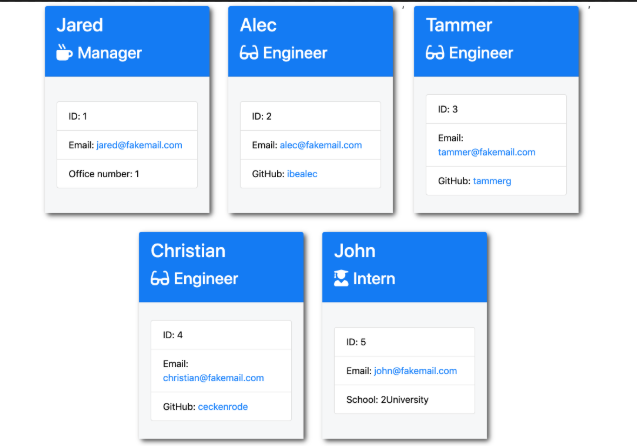

# Team-Profile-Generator

## Table of Contents

* [Decription](#description)
* [Installation](#installation)
* [Usage](#usage)
* [Collabarators](#collabarators)
* [License](#licenses)

## Description
Module that allows users to input information for new team members

## Installation
node app.js

## Usage
Given a user needs to put in a new team member, user will fill out information from propts.  When there are no more team members to add, select done.  The module will then populate an HTML file and automatically run in the browser

